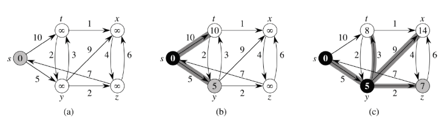
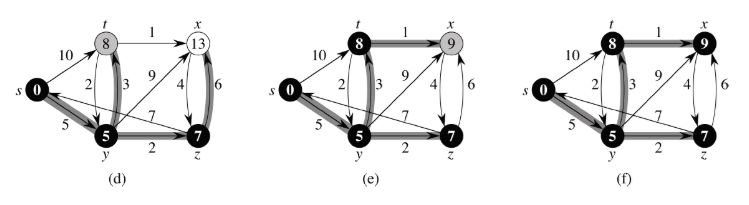

# 다익스트라 알고리즘

- concept

다익스트라 알고리즘은 너비우선탐색(BFS)을 기본으로 합니다.
하단 좌측과 같은 그래프를 대상으로 다익스트라 알고리즘을 적용해 보겠습니다.
우선 시작노드를 제외한 모든 노드의 거리정보를 무한대로 초기화합니다.
시작노드 s를 탐색하고 있다(processing)는 의미로 gray를 칠해둡니다.

(b)를 보겠습니다. 시작노드 s를 기준으로 BFS를 적용합니다. s에 바로 이웃한 t와 y에 대해 거리정보를 업데이트한 뒤 s 방문을 마쳤다는 의미로 black을 칠해둡니다. 다음 BFS 적용 대상은 방문하지 않은(white) 노드들 가운데 거리가 최소인 노드입니다. y가 5로 가장 작군요. y를 탐색하고 있다는 의미로 gray를 칠해둡니다.

(c)를 보겠습니다. y에 바로 이웃한 t,x,z에 대해 거리정보를 업데이트합니다. 시작노드 s와 t 사이의 기존 최단거리는 10이었습니다. 그런데 (s와 y 사이의 최단거리)+(y와 t 사이의 거리)=5+3=8이므로, s와 t 사이의 최단거리를 8로 바꾸고, 최단경로를 y를 경유하게끔 업데이트합니다(edge relaxation). 나머지 x,z도 이렇게 수행합니다. 이후 y 방문을 마쳤다는 의미로 black을 칠해 둡니다. 다음 BFS 적용 대상은 거리가 7로 가장 작은 미방문 노드인 z입니다. 탐색하고 있다는 의미로 gray를 칠해 둡니다.

(d)를 보겠습니다. z를 기준으로 BFS를 적용합니다. z에 바로 이웃한 y,x에 대해 거리정보를 업데이트합니다. y는 이미 방문을 마쳤으므로(black) 건너뛰고 x만 처리합니다. s와 x 사이의 기존 최단거리는 14였습니다. 그런데 (s와 z 사이의 최단거리)+(z와 x 사이의 거리)=7+6=13으로 기존보다 작으므로, s와 x 사이의 최단거리를 13으로 바꾸고, 최단경로를 z를 경유하게끔 업데이트합니다. 이후 z 방문을 마쳤다는 의미로 black을 칠해 둡니다. 다음 BFS 적용 대상은 거리가 8로 가장 작은 미방문 노드인 t입니다. 탐색하고 있다는 의미로 gray를 칠해 둡니다.

(e)를 보겠습니다. t를 기준으로 BFS를 적용합니다. t에 바로 이웃한 x에 대해 거리정보를 업데이트합니다. s와 x 사이의 기존 최단거리는 13였습니다. 그런데 (s와 t 사이의 최단거리)+(t와 x 사이의 거리)=8+1=9로 기존보다 작으므로, s와 x 사이의 최단거리를 9로 바꾸고, 최단경로를 t를 경유하게끔 업데이트합니다. 이후 t 방문을 마쳤다는 의미로 black을 칠해 둡니다. 다음 BFS 적용 대상은 거리가 9로 가장 작은 미방문 노드인 x입니다. 탐색하고 있다는 의미로 gray를 칠해 둡니다.

마지막으로 (f)를 보겠습니다. x를 기준으로 BFS를 적용합니다. x에 바로 이웃한 z에 대해 거리정보를 업데이트합니다. 그런데 z는 이미 방문을 마쳤으므로 건너뜁니다. 더 이상 처리할 이웃노드가 없으므로 x 탐색을 마치고 black을 칠해 둡니다.

이로써 모든 노드 방문을 마쳤습니다. 다익스트라 알고리즘을 종료합니다.
