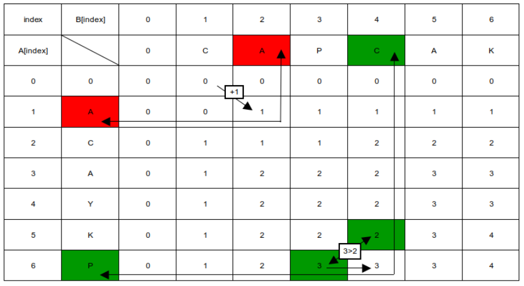

# LCS 풀이 방법

1. 빨간칸과 같이 같은 글자라면, 대각선 방향의 값 + 1을 넣어준다.
2. 초록칸과 같이 같은 글자가 아니라면, 해당칸에서 위 행의 값과 전 열의 값을 비교해서 큰 값을 넣어준다.
 
자세한 풀이 방법은 다음과 같다.  
C A P C 
A C

를 비교해보면, 2행 3열 까지의 값들을 보면 1로 되어있다.
그말은 CAP와 AC의 LCS가 1이라는 것이다.

거기에 2행 4열에 오면 같은 글자인 C가 된다. 그러므로 LCS값은 CAP AC의 LCS의 값에서 +1을 시켜주면 된다.

만약 같은 값이 아닐때에는 이전 행의 최대 LCS값과 해당 행의 이전 열의 LCS값을 비교해서 넣어준다.
